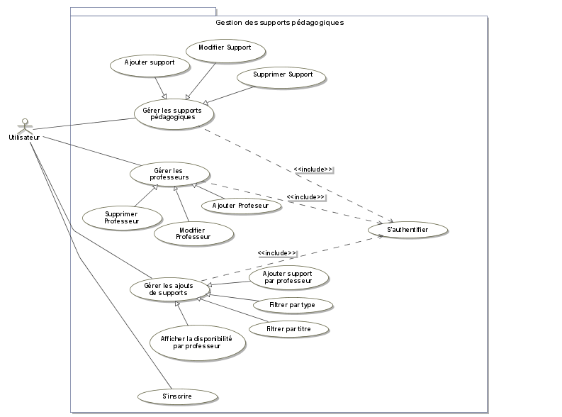
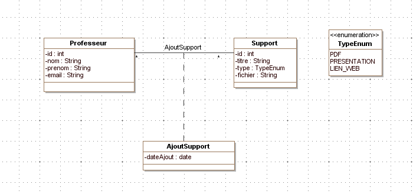
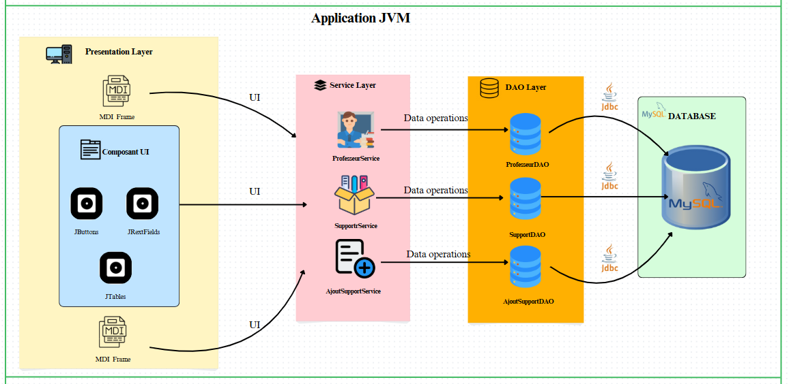

# Gestion des Supports Pédagogiques 📚
## Logo


## Description 📝

La Gestion des Supports Pédagogiques est une application Java Swing conçue pour centraliser et organiser les supports pédagogiques mis à disposition par les professeurs. Elle permet d'ajouter, filtrer et rechercher des supports en fonction de plusieurs critères, tout en offrant une visualisation statistique de leur répartition.


## Contexte 🌍

Dans un environnement académique, la gestion des supports pédagogiques est essentielle pour assurer un accès structuré et efficace aux ressources d’apprentissage. Cependant, ces supports sont souvent dispersés, rendant leur consultation et leur mise à jour difficiles. Cette application vise à centraliser ces documents, simplifier leur gestion et améliorer l’expérience des professeurs et des étudiants.


## Problématique ⚠️

Actuellement, le stockage et la gestion des supports pédagogiques se font souvent de manière informelle, via des dossiers partagés ou des plateformes variées. Cela pose des problèmes de recherche, d’accessibilité et d’organisation. Il est donc nécessaire d’avoir un système qui facilite la gestion et le suivi de ces supports de manière efficace et intuitive.

## Objectifs 🎯

* **Centraliser les informations :** Regrouper toutes les données relatives aux supports pédagogiques, aux étudiants et aux professeurs dans une base de données unique.
* **Faciliter la gestion :** Offrir une interface conviviale pour la création, la modification et la suppression des supports pédagogiques.
* **Optimiser la recherche :** Permettre une recherche efficace des supports pédagogiques par titre et un filtrage par professeur.
* **Offrir une visualisation statistique :** du nombre de supports par professeur à l’aide d’un graphique en barres.

## Diagrammes UML 🖥️

### Diagramme use case 



### Diagramme de classe



## Architecture 🏗️

 
 
## Technologies 💻

* **Langage :** Java
* **Framework d'interface graphique :** Java Swing
* **Base de données :** MySQL
* **Bibliothèque graphique :** JFreeChart
* **Outils de développement :**
    * IDE Java : NetBeans
    * Outil de diagramme : MagicDraw
    * Outil de gestion de base de données : phpMyAdmin
* **Accès aux données :** JDBC

##   Vidéo démonstrative sur les interfaces de l'application 🎥


[Démonstration](https://github.com/user-attachments/assets/09d7f5d3-28f3-4222-b58b-2aa5fc691371
)

## Structure de la Base de Données 🗄️

Le système repose sur quatre tables principales :

1.  **Professeur** : Informations sur les enseignants (id, ,nom, prénom, email).
2.  **Support** : Stocke les informations sur les supports pédagogiques (id, titre, type, fichier).
3.  **AjoutSupport** : Enregistre les ajouts de supports par les professeurs (support_id, professeur_id, date_ajout).
4.  **User** : Informations d'authentification (login, mot de passe).

### Schéma de la Base de Données 📊

```sql
CREATE TABLE professeur (
    id INT AUTO_INCREMENT PRIMARY KEY,
    nom VARCHAR(50) NOT NULL,
    prenom VARCHAR(50) NOT NULL,
    email VARCHAR(100) UNIQUE NOT NULL
);

CREATE TABLE support (
    id INT AUTO_INCREMENT PRIMARY KEY,
    titre VARCHAR(100) NOT NULL,
    type ENUM('PDF','PRESENTATION','LIEN_WEB'),
    fichier VARCHAR(255) NOT NULL
);

CREATE TABLE ajoutSupport (
    support_id INT NOT NULL,
    professeur_id INT NOT NULL,
    date_ajout DATE NOT NULL,
    PRIMARY KEY (support_id, professeur_id,date_ajout),
    FOREIGN KEY (support_id) REFERENCES Support(id) ON DELETE CASCADE ON UPDATE CASCADE,
    FOREIGN KEY (professeur_id) REFERENCES Professeur(id) ON DELETE CASCADE ON UPDATE CASCADE
);

CREATE TABLE user (
    login VARCHAR(255) PRIMARY KEY,
    password VARCHAR(255) NOT NULL,
    securityQuestion VARCHAR(255),
    securityAnswer VARCHAR(255),
    email VARCHAR(255)
);


